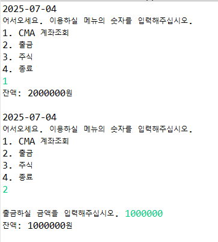
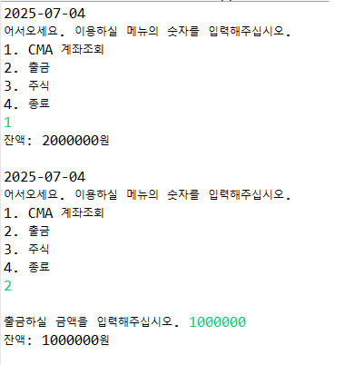
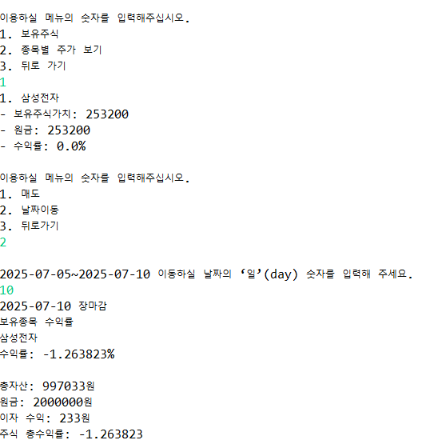

# ** 가치투자 기반 주식 시뮬레이터 **

## 소개  
사용자는 연동된 CMA 계좌에서 주식을 매수/매도할 수 있으며,  
날짜에 따른 주가 변화, 이자 수익, 수익률을 반영하여 시뮬레이션하는 Java 프로그램입니다.

## 주요 기능
   - CMA 계좌 이자 자동 계산
   - 현재 주가 기준 주식 매수 및 전량 매도
   - 종목별 일자별 주가 및 힌트 제공
   - 날짜 이동 시 이자 및 평가액 자동 갱신
   - 종목별 투자 원금, 수익, 수익률 계산
   - 시뮬레이션 종료 시 최종 수익 결과 출력

## 프로젝트 구조  
  src/  
    ├── account/  
    │   ├── CMAAccount.java   
    │   ├── CMAInterestCalculator.java  
    ├── atm/  
    │   └── ATM.java  
    ├── calendar/  
    │   └── Calendar.java  
    ├── exception/  
    │   └── InsufficientBalanceException.java  
    ├── main/  
    │   └── Simulator.java  
    ├── result/  
    │   ├── Result.java  
    │   └── ProfitCalculator.java  
    ├── stock/  
    │   ├── Holding.java  
    │   ├── SAMSUNG.java  
    │   ├── SK_HYNIX.java  
    │   ├── LG_ES.java  
    │   ├── Stock.java  
    │   ├── StockDB.java  
    │   └── StockMarket.java 

## 테스트  
   - JUnit 기반 테스트 코드 작성 완료
   - `ProfitCalculator.calculateROI()` 단위 테스트
   -  `CMAAccount.getBalanceWithInterest()` 단위 테스트

## 실행 방법  
   1. Java IDE(Eclipse, IntelliJ 등)에서 프로젝트 import
   2. `Simulator.java` 실행

## 실행 흐름  
   [사용자 입력]  
         ↓  
   [ATM 메뉴] → 계좌조회/출금/주식  
         ↓  
   [주식 메뉴] → 매수/매도/날짜 이동  
         ↓  
   [마지막 날짜 도달] → 수익률 결과 출력  

## 사용 기술  
   - Java 21
   - JUnit 단위 테스트
   - 객체지향 설계

## 실행 화면 예시 

### 메인 메뉴 ATM 실행

### 주식 매수 화면

### 최종 결과 출력

